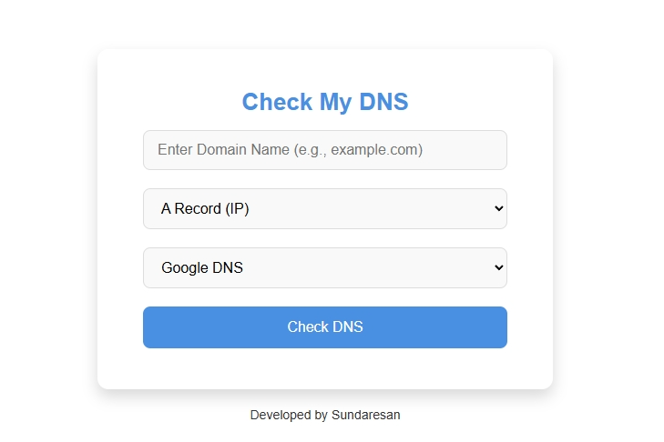

# 🌐 DNS Checker

  <b>DNS checker.</b>  
    
  
  
  
  
    
  

A simple **DNS Checker** web application that allows users to check DNS records for any domain using different DNS providers.

## 🚀 Features
- Supports multiple DNS providers:
  - Google DNS
  - Cloudflare DNS
  - OpenResolver DNS
  - Quad9 DNS
  - OpenDNS
- Fetches different record types: `A`, `AAAA`, `CNAME`, `MX`, `NS`, `PTR`, `TXT`, `SOA`, `SPF`
- Simple UI with domain input and dropdown selection
- Displays DNS records in real-time

## 📌 How to Use
1. **Enter a domain name** (e.g., `example.com`).  
2. **Select the record type** (`A`, `MX`, etc.).  
3. **Choose a DNS provider** (Google, Cloudflare, etc.).  
4. **Click "Check DNS"** and wait for the results.

## 🔗 Live Demo
🚀 **Try it here:** [DNS Checker](https://sundaresan-dev.github.io/DNS-cheker/)  

## 👨‍💻 Author
Developed by **Sundaresan** 🚀  
Feel free to contribute! 🤝  
